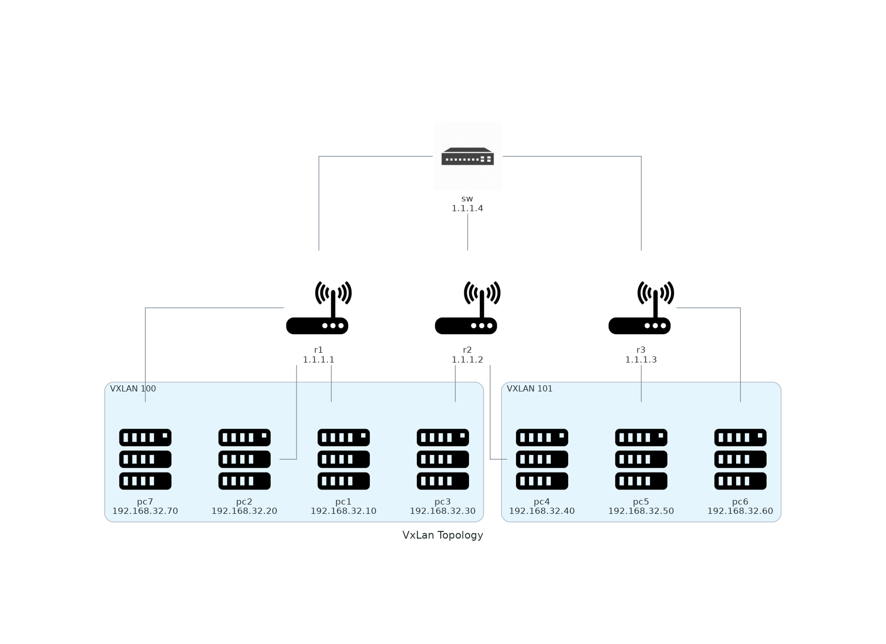

# Network Labs

Some network labs done with [containerlab](https://containerlab.dev/)

## Usage

```sh
make
```

## Default topology for vxlan



## Resources

Inspired from:
- https://vincent.bernat.ch/fr/blog/2017-vxlan-linux
- https://doc.ycharbi.fr/index.php/Vxlan
